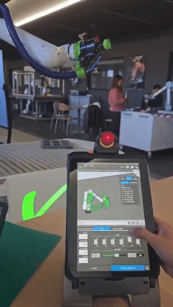
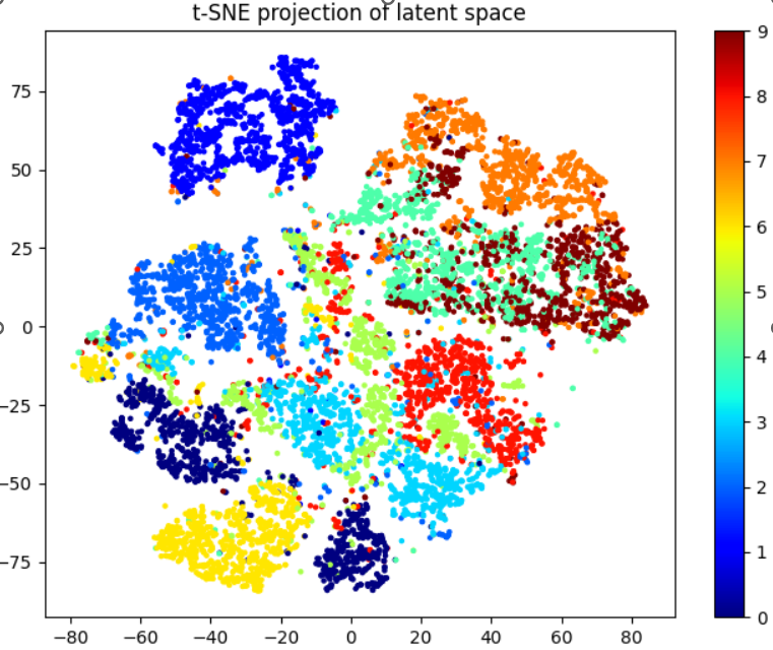
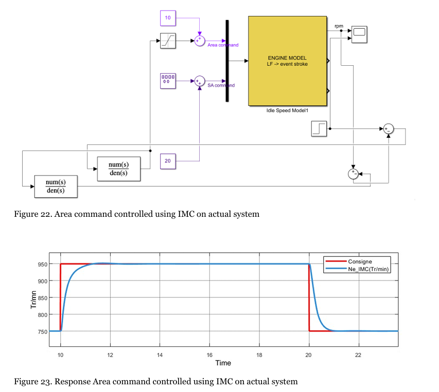
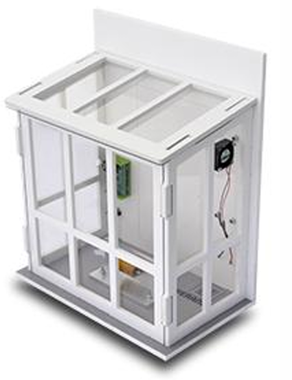

# University of Orleans 🎓

Here is an overview of the courses taken at the University of Orleans. The curriculum was primarily focused on Artificial Intelligence, IoT, and Robotics.

| Course | Image |
| --- | --- |
| **3MA04: Robotics** 🦾 - TP Robotics 🛠️ - Mechanical Transmission/ Transformation ⚙️ - Robot modeling and identification 📐 - Mobile Robots platform: study and modelisation 🚙 - Robotics applied to Medical 🏥 |  |
| **3MA03: Data analytics** 📊 - Signal processing 📡 - Introduction to I.A. tools 🤖 - Big data 📉 |  |
| **3MA05: Automation** ⚡ - Practicals Control design applied to Mobility 🚦 - Identification and control design of numerical systems 🎛️ - Diagnostic and observer 🔍 - Non-linear control design 〰️ - Data fusion 🔗 |  |
| **IoT** 🌐 - Processor architectures 💻 - Servers & Databases 🗄️ - Full Stack integration 🔄 - Smartphones(Elective) 📱 |  |
